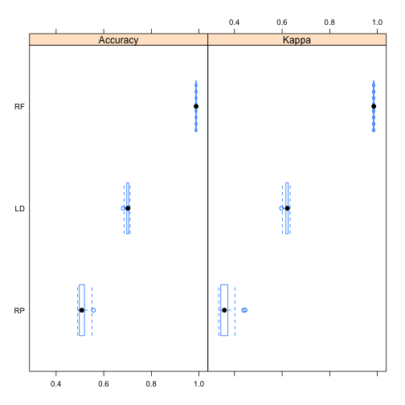

## Summary
The data set from http://groupware.les.inf.puc-rio.br/har quantifies how well 6 participants execute weight training exercises. The task is predict one of 5 ways (marked A to E) to execute exerices based on accelerometer data from sensors on the belt, forearm, arm, and on a light dumbell used to perform the exercises.

After data is cleaned, three prediction models are compared by applying them to the training data set before the winning model is applied to the supplied test data set. Winning model is a random forest, which achieves 0% out-of-sample error rate.

In the first code chunk some necessary libraries and the data is loaded.

## Data analysis and pre-processing
The data contained timestamp related data as well as row identifiers, which are deleted in the code chunk below. In addition we can get rid of the columns, which had a high degree of NA and empty values. Finally, the training data set is divided into training and validation sets. With these actions, the number of predictors in the data set drops from 159 to 52 (which still is too many to plot)

```r
dim(training)
```

```
## [1] 19622   160
```

```r
# drop non-predictive columns
training <- training[, -which(names(training) %in% c("X", "user_name", "raw_timestamp_part_1",                                                           "raw_timestamp_part_2", "cvtd_timestamp",
                                                     "new_window", "num_window"))]
# drop columns with over 10% empty values
training <- training[, -which(colSums(is.na(training)) > .1 * nrow(training))]
dim(training)
```

```
## [1] 19622    53
```

```r
# sub-divide training set further to training and validating sets
sub_train <- createDataPartition(training$classe, p = 0.7, list = FALSE)
training <- training[sub_train, ]
validating <- training[-sub_train, ]
```
## Model comparison
Now it's possible to start training some models, and cross-validating against the validation set split in the previous code chunk.

```r
## classification tree
fit_rp <- train(classe ~ ., data = training, method = "rpart")
pred_rp <- predict(fit_rp, validating)
conf_rp <- confusionMatrix(validating$classe, pred_rp)

## linear discriminant analysis
fit_lda <- train(classe ~ ., data = training, method = "lda")
pred_lda <- predict(fit_lda, validating)
conf_lda <- confusionMatrix(validating$classe, pred_lda)

## random forest
registerDoMC(cores = 7) # use more CPU cores, RF takes forever otherwise...
fit_rf <- train(classe ~ ., data = training, method = "rf")
pred_rf <- predict(fit_rf, validating)
conf_rf <- confusionMatrix(validating$classe, pred_rf)

res_df <- data.frame(model = c("rpart", "lda", "rf"),
                     accuracy = c(conf_rp$overall["Accuracy"],
                                 conf_lda$overall["Accuracy"],
                                 conf_rf$overall["Accuracy"]))
res_df$out_of_sample_error <- 1 - res_df$accuracy
res_df
```

```
##   model  accuracy out_of_sample_error
## 1 rpart 0.4983067           0.5016933
## 2   lda 0.7031930           0.2968070
## 3    rf 1.0000000           0.0000000
```
Based on accuracy and out of sample errors, the most accurate prediction is achieved with the random forest. It also takes by far the most amount of computational effort to calculate. Some deeper analysis into the differences between the models:

```r
conf_rf$table
```

```
##           Reference
## Prediction    A    B    C    D    E
##          A 1190    0    0    0    0
##          B    0  776    0    0    0
##          C    0    0  726    0    0
##          D    0    0    0  678    0
##          E    0    0    0    0  764
```

```r
results <- resamples(list(RP = fit_rp, LD = fit_lda, RF = fit_rf))
summary(results)
```

```
## 
## Call:
## summary.resamples(object = results)
## 
## Models: RP, LD, RF 
## Number of resamples: 25 
## 
## Accuracy 
##      Min. 1st Qu. Median   Mean 3rd Qu.   Max. NA's
## RP 0.4902  0.4972 0.5078 0.5101  0.5190 0.5568    0
## LD 0.6821  0.6964 0.7014 0.7001  0.7047 0.7100    0
## RF 0.9836  0.9866 0.9881 0.9878  0.9891 0.9912    0
## 
## Kappa 
##      Min. 1st Qu. Median   Mean 3rd Qu.   Max. NA's
## RP 0.3340  0.3422 0.3575 0.3632  0.3720 0.4448    0
## LD 0.5977  0.6157 0.6220 0.6202  0.6256 0.6336    0
## RF 0.9792  0.9831 0.9849 0.9846  0.9862 0.9889    0
```

```r
bwplot(results)
```


## Prediction
The most accurate prediction is clearly the random forest, which is finally applied to the supplied test set for the prediction. 

```r
pred_final <- predict(fit_rf, testing)
pred_final
```

```
##  [1] B A B A A E D B A A B C B A E E A B B B
## Levels: A B C D E
```
